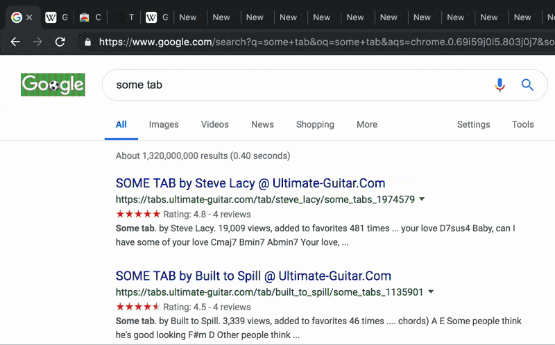

For a long time, I've struggled with having too many tabs open. I tried looking through my tabs each week, and using tab manager Chrome extensions, but I still didn't have a good way to quickly look over and close my tabs.

So I'm writing a Chrome extension that can close tabs quickly. With this Chrome extension, you can quickly close some tabs and then go back to the tab you were on:

- From anywhere, jump to the list of tabs with `Ctrl+.` or `Cmd+.`
- Use the arrow keys to navigate
- Press Backspace to close tabs
- Then jump back to your original tab by selecting it and pressing Enter

## Installing

First, build the extension with `yarn && yarn build`.

Then follow Chrome's instructions to [switch to developer mode and load the extension unpacked.](https://developer.chrome.com/extensions/getstarted#manifest)
